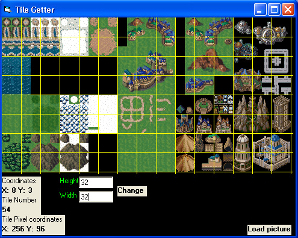



## \[Tile Getter\] \- Cuts a picture and displays coordinates

### Description

This is a handy, commented tool especially for those who use bitblt functions etc for their games and they only have one big picture to work with, that has all those different images in it combined. This will create cells in that image with a width and height specified by user and then it gives you coordinates of the particular cell you click on. I found it very handy in my case and i always see more and more people having a problem with this. So, here is your solution :) Enjoy and vote :)
 
### More Info
 

             |
---                |---
**Submitted On**   |2003-12-31 15:30:46
**By**             |[Mephisto](https://github.com/Planet-Source-Code/PSCIndex/blob/master/ByAuthor/mephisto.md)
**Level**          |Intermediate
**User Rating**    |4.6 (37 globes from 8 users)
**Compatibility**  |VB 6\.0
**Category**       |[Games](https://github.com/Planet-Source-Code/PSCIndex/blob/master/ByCategory/games__1-38.md)
**World**          |[Visual Basic](https://github.com/Planet-Source-Code/PSCIndex/blob/master/ByWorld/visual-basic.md)
**Archive File**   |[\[Tile\_Gett16885412312003\.zip](https://github.com/Planet-Source-Code/mephisto-tile-getter-cuts-a-picture-and-displays-coordinates__1-50687/archive/master.zip)

